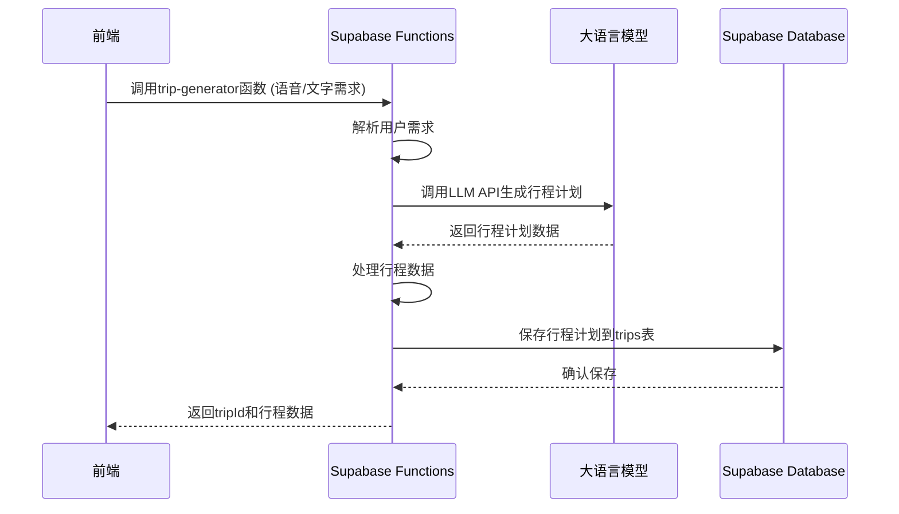
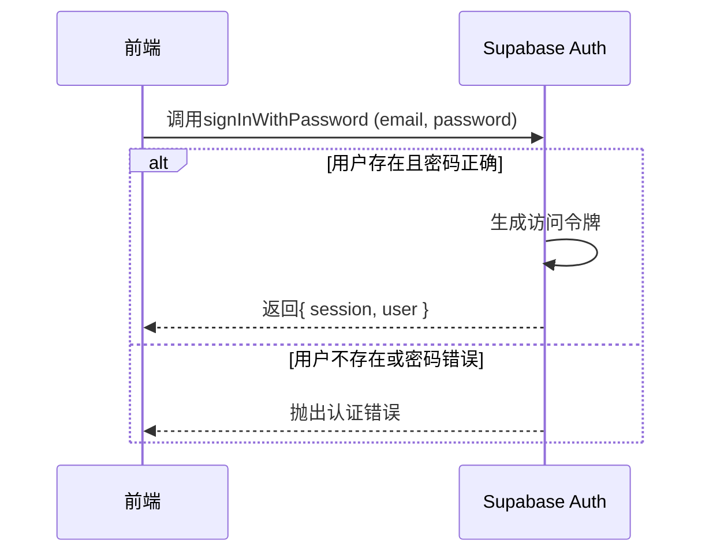

# AI 旅行规划师 (AI Travel Planner) 技术架构设计文档

## 1. 系统概述

AI 旅行规划师是一款基于 AI 技术的 Web 应用，旨在通过自然语言处理和智能算法，帮助用户快速生成个性化旅行计划，并提供费用管理和数据同步功能。

## 2. 技术栈选型

### 2.1 前端技术栈

| 技术/框架     | 版本  | 用途         | 选型理由                             |
| ------------- | ----- | ------------ | ------------------------------------ |
| React         | 18.x  | 前端 UI 框架 | 组件化开发，性能优秀，生态丰富       |
| TypeScript    | 5.x   | 编程语言     | 类型安全，提高代码质量和可维护性     |
| Redux Toolkit | 1.9.x | 状态管理     | 简化 Redux 使用，更好的开发体验      |
| Ant Design    | 5.x   | UI 组件库    | 美观的界面组件，丰富的功能支持       |
| Axios         | 1.4.x | HTTP 客户端  | 简洁的 API，拦截器功能强大           |
| 高德地图 API  | -     | 地图服务     | 国内覆盖全面，提供地图展示和导航功能 |
| React Router  | 6.x   | 路由管理     | 声明式路由，易于使用                 |
| Vite          | 4.x   | 构建工具     | 快速的开发服务器和构建性能           |

### 2.2 后端技术栈（Supabase）

| 技术/框架         | 版本       | 用途         | 选型理由                            |
| ----------------- | ---------- | ------------ | ----------------------------------- |
| Supabase          | 最新版     | 后端即服务   | 提供完整的后端解决方案，包括数据库、认证、存储等 |
| PostgreSQL        | 14.x+      | 关系型数据库 | 强大的开源数据库，支持JSON数据类型和复杂查询 |
| Supabase Auth     | 内置       | 认证系统     | 提供用户注册、登录、密码重置等功能  |
| Supabase Storage  | 内置       | 文件存储     | 用于存储用户上传的图片和文档        |
| Supabase Functions| 内置       | 服务端函数   | 用于处理复杂业务逻辑和API集成       |
| Supabase Realtime | 内置       | 实时数据同步 | 支持数据变更的实时推送              |

### 2.3 AI 与第三方服务

| 服务                | 用途         | 选型理由                                 |
| ------------------- | ------------ | ---------------------------------------- |
| OpenAI API/文心一言 | 大语言模型   | 强大的自然语言处理能力，适合生成旅行计划 |
| 科大讯飞 API        | 语音识别     | 中文语音识别准确率高，本地化支持好       |
| 高德地图 API        | 地理位置服务 | 提供 POI 搜索、路径规划、地图展示等功能  |

### 2.4 DevOps 工具

| 工具           | 用途     | 选型理由               |
| -------------- | -------- | ---------------------- |
| Docker         | 容器化   | 环境一致性，简化部署   |
| GitHub Actions | CI/CD    | 自动化构建、测试和部署 |
| Jest           | 单元测试 | JavaScript 测试框架    |
| React Testing Library | UI测试 | 前端组件测试工具 |
| ESLint         | 代码质量 | JavaScript 代码检查工具 |
| Prettier       | 代码格式化 | 统一代码风格工具 |

## 3. 系统架构设计

### 3.1 整体架构

采用前后端分离架构，后端使用Supabase BaaS服务：

```
┌─────────────────────────┐
│      前端应用层         │
│  (React + TypeScript)   │
└─────────────┬───────────┘
              │
              ▼
┌───────────────────────────────────────────────────────┐
│                  Supabase BaaS平台                    │
│  ┌─────────────┐  ┌────────────┐  ┌──────────────┐   │
│  │  PostgreSQL │  │  Auth      │  │  Storage     │   │
│  │  数据库     │  │  认证服务  │  │  文件存储    │   │
│  └─────────────┘  └────────────┘  └──────────────┘   │
│  ┌─────────────┐  ┌────────────┐                    │
│  │  Functions  │  │  Realtime  │                    │
│  │  服务端函数 │  │  实时同步  │                    │
│  └─────────────┘  └────────────┘                    │
└───────────────────────────────────────────────────────┘
              │
              ▼
┌─────────────────────────┐
│      第三方AI服务       │
│ (OpenAI/科大讯飞/高德地图)│
└─────────────────────────┘
```

### 3.2 系统模块划分

#### 3.2.1 前端模块

```
src/
├── components/      # 共享组件
├── pages/           # 页面组件
├── hooks/           # 自定义React Hooks
├── services/        # API服务
│   ├── supabase/    # Supabase客户端配置
│   ├── ai/          # AI服务集成
│   └── api.ts       # API请求封装
├── store/           # Redux状态管理
├── types/           # TypeScript类型定义
├── utils/           # 工具函数
└── assets/          # 静态资源
```

#### 3.2.2 Supabase后端结构

```
supabase/
├── migrations/      # 数据库迁移脚本
├── functions/       # 服务端函数
│   ├── trip-generator/  # 行程生成函数
│   ├── budget-calculator/ # 预算计算函数
│   └── ai-integration/  # AI服务集成函数
└── seed.sql         # 初始数据填充
```

### 3.3 关键流程图

#### 3.3.1 AI 行程生成流程



#### 3.3.2 用户认证流程


