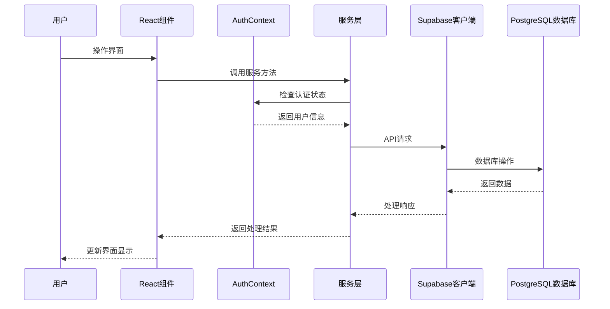
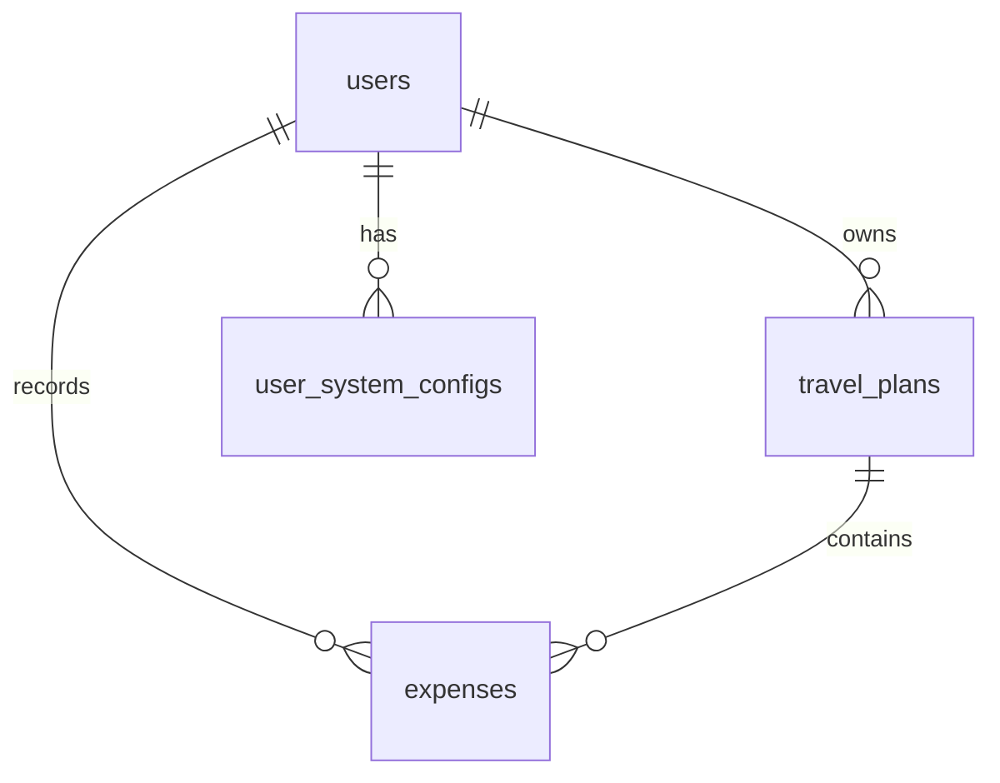
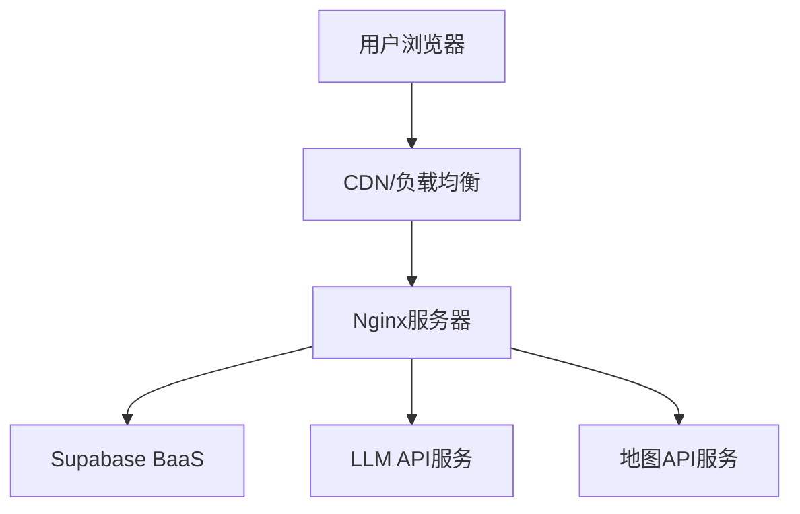

# AI 旅行规划师 - 技术架构设计文档

## 1. 概述

### 1.1 文档目的
本文档详细描述AI旅行规划师系统的技术架构设计，包括前端架构、后端集成、数据库设计、API交互以及部署方案，为开发团队提供系统实现的技术指导。

### 1.2 系统定位
AI旅行规划师是一款基于人工智能技术的Web应用，为用户提供智能化、个性化的旅行规划服务，包括语音输入、AI行程生成、费用管理和多设备数据同步等功能。

### 1.3 术语定义
| 术语 | 解释 |
| :--- | :--- |
| LLM | Large Language Model，大语言模型，用于生成旅行计划 |
| BaaS | Backend as a Service，后端即服务，如Supabase |
| API | Application Programming Interface，应用程序编程接口 |
| JWT | JSON Web Token，用于身份认证的令牌 |
| SPA | Single Page Application，单页应用 |
| Web Speech API | 浏览器内置的语音识别API |

## 2. 系统架构概览

### 2.1 架构风格
系统采用前后端分离的单页应用(SPA)架构，结合BaaS(Backend as a Service)模式，通过API集成提供完整功能。

### 2.2 整体架构图
```
mermaid
flowchart TD
    subgraph 客户端层
        Browser["浏览器"]
        WebApp["React SPA应用"]
        SpeechAPI["Web Speech API"]
        Browser --> WebApp
        WebApp --> SpeechAPI
    end

    subgraph 前端应用层
        React["React组件"]
        Context["React Context"]
        Services["服务层"]
        React --> Context
        React --> Services
        Context --> Services
    end

    subgraph 后端服务层
        SupabaseClient["Supabase Client"]
        SupabaseAuth["Supabase Auth"]
        SupabaseDB["Supabase Database"]
        SupabaseStorage["Supabase Storage"]
        LLMService["LLM API服务"]
        MapAPI["地图API"]
    end

    WebApp --> SupabaseClient
    Services --> SupabaseClient
    Services --> LLMService
    Services --> MapAPI
    SupabaseClient --> SupabaseAuth
    SupabaseClient --> SupabaseDB
    SupabaseClient --> SupabaseStorage
```

### 2.3 核心组件关系
- **前端应用**：基于React构建的SPA应用，负责用户界面和交互逻辑
- **认证系统**：基于Supabase Auth实现的用户认证和授权
- **数据存储**：使用Supabase PostgreSQL存储用户数据和旅行计划
- **AI服务**：集成大语言模型API生成旅行计划
- **地图服务**：集成地图API进行位置展示和路线规划

## 3. 前端架构设计

### 3.1 技术栈
| 类别 | 技术/框架 | 版本 | 用途 |
| :--- | :--- | :--- | :--- |
| 核心框架 | React | 18.2.0 | 前端UI构建 |
| 路由管理 | React Router | 6.25.1 | 页面路由和导航 |
| 构建工具 | Vite | 5.0.8 | 开发服务器和构建 |
| UI组件 | 自定义组件 | - | 应用UI组件 |
| HTTP客户端 | supabase-js | 2.38.4 | API调用 |
| 地图集成 | react-bmapgl | 1.0.1 | 地图可视化 |
| 语音识别 | Web Speech API | - | 浏览器内置语音识别 |

### 3.2 目录结构
```
src/
├── components/      # 通用组件
│   ├── LoadingSpinner.jsx
│   ├── MapComponent.jsx
│   └── ProtectedRoute.jsx
├── contexts/        # React Context
│   └── AuthContext.jsx
├── pages/           # 页面组件
│   ├── ExpenseManagementPage.jsx
│   ├── LoginPage.jsx
│   ├── MyPlansPage.jsx
│   ├── RegisterPage.jsx
│   └── UserProfilePage.jsx
├── services/        # 服务层
│   ├── encryptionService.js
│   ├── llmService.js
│   ├── speechRecognitionService.js
│   ├── systemConfigService.js
│   ├── travelPlanService.js
│   └── userPreferencesService.js
├── styles/          # 样式文件
├── App.jsx          # 应用入口组件
├── App.css          # 全局样式
├── index.css        # 基础样式
├── main.jsx         # 应用入口点
└── supabaseClient.js # Supabase客户端配置
```

### 3.3 组件结构
1. **页面组件**
   - HomePage：首页，提供旅行计划生成功能
   - LoginPage/RegisterPage：用户认证页面
   - MyPlansPage：旅行计划管理页面
   - ExpenseManagementPage：费用管理页面
   - UserProfilePage：用户配置页面

2. **通用组件**
   - ProtectedRoute：受保护的路由组件
   - LoadingSpinner：加载状态组件
   - MapComponent：地图显示组件

### 3.4 状态管理
- 使用React Context API进行全局状态管理
- AuthContext管理用户认证状态
- 组件内部状态使用useState和useEffect

### 3.5 数据流


## 4. 后端集成架构

### 4.1 技术栈
| 类别 | 技术/服务 | 用途 |
| :--- | :--- | :--- |
| BaaS平台 | Supabase | 后端即服务平台 |
| 数据库 | PostgreSQL | 关系型数据库 |
| 认证 | Supabase Auth | 用户认证和授权 |
| 存储 | Supabase Storage | 文件和对象存储 |
| 函数 | Supabase Edge Functions | 服务端逻辑（预留） |

### 4.2 Supabase集成
- 通过@supabase/supabase-js客户端库与Supabase服务交互
- 环境变量配置Supabase URL和API密钥
- 封装认证、数据和存储服务

### 4.3 认证架构
- 基于JWT的身份验证系统
- 支持邮箱/密码注册登录
- 会话状态管理和监听
- 受保护路由机制

### 4.4 服务层设计
- **travelPlanService**：旅行计划的CRUD操作
- **systemConfigService**：用户系统配置管理
- **encryptionService**：敏感数据加密解密
- **llmService**：大语言模型API调用
- **speechRecognitionService**：语音识别功能

## 5. 数据库与存储架构

### 5.1 数据库设计
系统使用PostgreSQL作为主数据库，包含以下核心表：

#### 5.1.1 users表（Supabase内置）
| 字段名 | 数据类型 | 约束 | 描述 |
| :--- | :--- | :--- | :--- |
| id | UUID | PRIMARY KEY | 用户唯一标识符 |
| email | VARCHAR | UNIQUE NOT NULL | 用户邮箱 |
| password_hash | VARCHAR | NOT NULL | 密码哈希值 |
| created_at | TIMESTAMP | DEFAULT CURRENT_TIMESTAMP | 创建时间 |
| updated_at | TIMESTAMP | DEFAULT CURRENT_TIMESTAMP | 更新时间 |

#### 5.1.2 travel_plans表
| 字段名 | 数据类型 | 约束 | 描述 |
| :--- | :--- | :--- | :--- |
| id | SERIAL | PRIMARY KEY | 计划ID |
| user_id | UUID | REFERENCES users(id) | 用户ID |
| plan_name | VARCHAR | NOT NULL | 计划名称 |
| destination | VARCHAR | NOT NULL | 旅行目的地 |
| duration | INTEGER | NOT NULL | 旅行天数 |
| travelers | INTEGER | NOT NULL DEFAULT 1 | 旅行人数 |
| budget | DECIMAL(10,2) | NOT NULL DEFAULT 0.00 | 预算金额 |
| accommodation | TEXT | NOT NULL | 住宿信息（JSON格式） |
| transportation | TEXT | NOT NULL | 交通信息（JSON格式） |
| daily_plans | TEXT | NOT NULL | 每日行程安排（JSON格式） |
| tips | TEXT | NOT NULL | 旅行贴士（JSON格式） |
| original_request | TEXT | NOT NULL | 原始请求信息 |
| created_at | TIMESTAMP | DEFAULT CURRENT_TIMESTAMP | 创建时间 |
| updated_at | TIMESTAMP | DEFAULT CURRENT_TIMESTAMP | 更新时间 |

#### 5.1.3 user_system_configs表
| 字段名 | 数据类型 | 约束 | 描述 |
| :--- | :--- | :--- | :--- |
| id | SERIAL | PRIMARY KEY | 配置ID |
| user_id | UUID | REFERENCES users(id) UNIQUE | 用户ID |
| llmApiBaseUrl | TEXT | NOT NULL | 大语言模型API地址（加密） |
| llmApiKey | TEXT | NOT NULL | 大语言模型API密钥（加密） |
| baiduMapApiKey | TEXT | NOT NULL | 百度地图API密钥（加密） |
| created_at | TIMESTAMP | DEFAULT CURRENT_TIMESTAMP | 创建时间 |
| updated_at | TIMESTAMP | DEFAULT CURRENT_TIMESTAMP | 更新时间 |

#### 5.1.4 expenses表
| 字段名 | 数据类型 | 约束 | 描述 |
| :--- | :--- | :--- | :--- |
| id | SERIAL | PRIMARY KEY | 费用记录ID |
| travel_plan_id | INTEGER | REFERENCES travel_plans(id) | 旅行计划ID |
| user_id | UUID | REFERENCES users(id) | 用户ID |
| item | VARCHAR | NOT NULL | 费用项目 |
| amount | DECIMAL(10,2) | NOT NULL | 费用金额 |
| created_at | TIMESTAMP | DEFAULT CURRENT_TIMESTAMP | 创建时间 |

### 5.2 数据关系图


### 5.3 数据加密策略
- 敏感配置数据（API密钥）在前端进行加密后存储
- 使用自定义加密服务进行加密和解密操作
- 加密密钥安全管理

## 6. API设计与集成

### 6.1 内部API

#### 6.1.1 认证API
- `auth.signUp(email, password)` - 用户注册
- `auth.signIn(email, password)` - 用户登录
- `auth.signOut()` - 用户登出
- `auth.getCurrentUser()` - 获取当前用户信息
- `auth.onAuthStateChange(callback)` - 监听认证状态变化

#### 6.1.2 旅行计划API
- `travelPlanService.saveTravelPlan(userId, plan)` - 保存旅行计划
- `travelPlanService.getUserTravelPlans(userId)` - 获取用户旅行计划列表
- `travelPlanService.getTravelPlanDetails(planId, userId)` - 获取旅行计划详情
- `travelPlanService.updateTravelPlan(planId, userId, updatedPlan)` - 更新旅行计划
- `travelPlanService.deleteTravelPlan(planId, userId)` - 删除旅行计划

#### 6.1.3 系统配置API
- `systemConfigService.saveUserSystemConfig(config)` - 保存用户系统配置
- `systemConfigService.getUserSystemConfig()` - 获取用户系统配置
- `systemConfigService.deleteUserSystemConfig()` - 删除用户系统配置

### 6.2 第三方API集成

#### 6.2.1 大语言模型API
- 支持配置自定义API端点和密钥
- 使用HTTP请求调用LLM服务生成旅行计划
- 支持多种LLM提供商（如智谱AI等）

#### 6.2.2 地图API
- 集成百度地图API
- 支持地点搜索和路线规划
- 可视化显示旅行行程

#### 6.2.3 语音识别API
- 使用浏览器内置Web Speech API
- 支持中文语音识别
- 集成到旅行计划输入流程

## 7. 部署与运维架构

### 7.1 部署架构
系统采用容器化部署方式，使用Docker容器封装前端应用，通过Nginx提供静态资源服务。



### 7.2 持续集成/持续部署
- 使用GitHub Actions实现CI/CD流程
- 自动构建Docker镜像
- 版本标签生成和管理
- 自动上传构建产物到GitHub Release

### 7.3 环境变量管理
- 使用.env文件管理环境配置
- 开发环境和生产环境分离
- 敏感信息不提交到代码仓库

## 8. 安全性设计

### 8.1 认证与授权
- 基于JWT的身份验证
- 受保护路由机制
- 会话管理和过期处理

### 8.2 数据安全
- 敏感数据加密存储
- HTTPS传输加密
- 数据库访问权限控制

### 8.3 API安全
- API密钥管理
- 请求验证和错误处理
- 防止SQL注入和XSS攻击

## 9. 性能优化

### 9.1 前端优化
- 组件懒加载
- 代码分割
- 缓存策略
- 图片优化

### 9.2 数据库优化
- 索引设计
- 查询优化
- JSON字段使用策略

### 9.3 API优化
- 请求合并
- 响应缓存
- 错误重试机制

## 10. 扩展性设计

### 10.1 功能扩展
- 模块化服务设计
- 预留API集成接口
- 配置驱动的功能开关

### 10.2 性能扩展
- 支持水平扩展
- 数据库读写分离（预留）
- CDN加速（预留）

## 11. 监控与维护

### 11.1 日志管理
- 前端错误日志
- 后端API调用日志
- 系统配置日志

### 11.2 性能监控
- 页面加载性能
- API响应时间
- 数据库查询性能

### 11.3 常见问题处理
- 认证失败处理
- 数据同步冲突
- API超时重试
